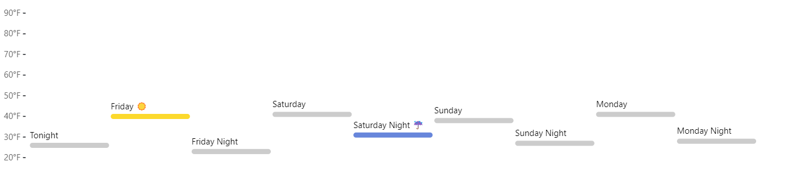

```{r setup, include=FALSE}
knitr::opts_chunk$set(echo = TRUE)
```

## Git, GitHub

1. *What is your GitHub username?*

    Aishwarya0898

2. *What is the URL of your remote GitHub repo (created through Mr. Kennedy's exercises)?*

    https://github.com/Aishwarya0898/MyRepo

## R

The command below will load the tidyverse package.  If you have installed R, RStudio, and the tidyverse package, it should display a list of loaded packages and their versions.
```{r}
library(tidyverse)
```

## R Markdown 

1. *Create a bulleted list with at least 3 items*
 * Computer
 * Masters
 * Spring

2. *Write a single paragraph that demonstrates the use of italics, bold, bold italics, code, and includes a link. The paragraph does not have to make sense.*
 
    This is  *Aishwarya Ramesh*
    
    This is  **Aishwarya Ramesh**

    This is  ***Aishwarya Ramesh***
    
    This is  `Aishwarya Ramesh`
    
    
    My favorite search engine is [Data Visualisation](https://datavisualisation.com).
         
3. *Create a level 3 heading*

### Heading Level 3

## R 

#### Data Visualization Exercises

1. (Q2) *How many rows are in mpg? How many columns?*

```{r}
ggplot2::mpg
```

1. (Q4) *Make a scatterplot of hwy vs cyl.*

```{r}
ggplot(data = mpg) + 
geom_point(mapping = aes(x = cyl, y = hwy))
```

#### Workflow: basics Exercises

1. (Q2) *Tweak each of the following R commands so that they run correctly (`library(tidyverse)` is correct):*

```r
library(tidyverse)
ggplot(dota = mpg) + 
  geom_point(mapping = aes(x = displ, y = hwy))

fliter(mpg, cyl = 8)

filter(diamond, carat > 3)
```

```{r}
ggplot(data = mpg) + 
  geom_point(mapping = aes(x = displ, y = hwy))

filter(mpg, cyl == 8)

filter(diamonds, carat > 3)
```

## Google Colab

1. *What are the URLs of your Google Colab notebooks (both Python and R)?*

    Python - URL https://colab.research.google.com/drive/1u_TBuCwDhC6obsV-f38YGbBnt5P6zBxd?usp=sharing
    
     R - URL https://colab.research.google.com/drive/1VdcIR71UnjRC66m0ePq7pSAAOTbPrDgQ?usp=sharing
        
        
## Tableau

*Insert your the image of your final bar chart here*

  

1. *What conclusions can you draw from the chart?*

    When we observe the graph we can see the east area has the most phone sales but south has the highest sales in machines. The profit is negative


## Observable and Vega-Lite

### A Taste of Observable

1. *In the "New York City weather forecast" section, try replacing `Forecast: detailedForecast` with `Forecast: shortForecast`. Then press the blue play button  or use Shift-Return to run your change. What happens?*

    The long description in the forecast changes to a short one.
    Example : In the first row the, the forcast description changes to 'Mostly cloudy'.

1. *Under the scatterplot of temperature vs. name, try replacing `markCircle()` with `markSquare()`. Then press the blue play button  or use Shift-Return to run your change. What happens? How about `markPoint()`?*

    When we change to markSquare() the points which was in circle changed to square.
    When we use markPoint() the points are changing to hollow circle. 

1. *Under "Pick a location, see the weather forecast", pick a location on the map.  Where was the point you picked near?*

     I picked Longitude :-101.49 Latitude 33.99

1. *The last visualization on this page is a "fancy" weather chart embedded from another notebook.  Click on the 3 dots next to that chart and choose 'Download PNG'.  Insert the PNG into your report.*



### Charting with Vega-Lite

`markCircle()`

1. *Pass an option of `{ size: 200 }` to `markCircle()`.*
    


1. *Try `markSquare` instead of `markCircle`.*


1. *Try `markPoint({ shape: 'diamond' })`.*


`vl.x().fieldQ("Horsepower")`, ...

1. *Change `Horsepower` to `Acceleration`*


1. *Swap what fields are displayed on the x- and y-axis*


`vl.tooltip().fieldN("Name")`

1. *Change `Name` to `Origin`.*

    When we changed the name to origin we can see the country name when move the cursor on graph

Another example, `count()`

1. *Remove the `vl.y().fieldN("Origin")` line.*

    We cannot see any label when we hover the cursor on it. 

1. *Replace `count()` with `average("Miles_per_Gallon")`.*

    When we replace average we can see the average miles per gallon of a particular country.

## References

*Every report must list the references that you consulted while completing the assignment. If you consulted a webpage, you must include the URL.*

* Insert Reference 1, https://r4ds.had.co.nz/data-visualisation.html
* Insert Reference 2, https://observablehq.com/@observablehq/vega-lite
* Insert Reference 3, https://observablehq.com/@tomb/a-taste-of-observable
* Reference 4, https://r4ds.had.co.nz/workflow-basics.html#practice
* Reference 5, https://colab.research.google.com/drive/165dTuQy5P7cgG8QqZMuLWP02LD9fLpLJ#scrollTo=qJAKN6380cJc
* Reference 6, https://observablehq.com/@tomb/a-taste-of-observable
* Reference 7, https://www.tableau.com/academic/students
* Reference 8, https://r4ds.had.co.nz/workflow-basics.html#practice
* Reference 9, https://colab.research.google.com/drive/165dTuQy5P7cgG8QqZMuLWP02LD9fLpLJ#scrollTo=s8aeChJ4_pgz